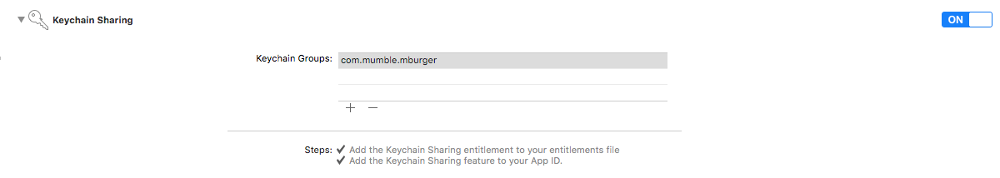

# MBAuth

All the authentication apis are contained in the `MBAuth` class. You can register a user to MBurger, authenticate that user, and retrieve its informations.

# Register a user

To register a user you call `[MBAuth registerUserWithName:surname:...]`. The fields, `name`, `surname`, `email` and `password` are required, the otheer are optional. The field `data` is an arbitrary object (array or dictionary) representing additional data that you want to pass when registering the user. It will be returned when retrieving the profile.

**Objective-C**:

```objective-c
[MBAuth registerUserWithName:@"name"
						 Surname:@"surname"
						   Email:@"email"
					 	Password:@"password"
						   Phone:@"phone"
						   Image:nil
							 Data:nil
						 Success:^{
                             
						 } Failure:^(NSError *error) {
                             
}];
```

**Swift**:

```swift
MBAuth.registerUser(withName: "name", surname: "surname", email: "email", password: "password", phone: "1234567890", image: nil, data: nil, success: {
            
}, failure: { (error) in
            
})
```

# Authenticate a user

After registeering the user you can authenticate it with its email and password. All the communication with the server is made in https so all the data are encrypted. If the authentication is correct the api will return the access token. This token will be put in the `Authorization` header for all the subsequent call to all the MBurger apis.

**Objective-C**:

```objective-c
[MBAuth authenticateUserWithEmail:@"email" Password:@"password" Success:^(NSString *accessToken) {
        
} Failure:^(NSError *error) {
        
}];
```
**Swift**:

```swift
MBAuth.authenticateUser(withEmail: "email", password: "password", success: { (accessToken) in
            
}, failure: { (error) in
            
})

```

You can see if a user is curreently authenticated with `[MBAuth userIsLoggedIn]`.

If a user is authenticated you can retrieve its access token with `[MBAuth authToken]`.

To logout the current user use `[MBAuth logoutCurrentUser]`.

MBAuth saves the user information in a Keychain using `SAMKeychain`.
If you are having issues when authenticating a user with the message `Couldn't add the Keychain Item.` turn on Keychain sharing in your app capabilities section for your app and add `com.mumble.mburger`. This should fix it.



# Retrieve user informations

You can retrieve the informations of the current user with `[getUserProfileWithSuccess:failure]`. In case of succes it returns a `MBUser` object as a parameter of the success block.

**Objective-C**:

```objective-c
[MBAuth getUserProfileWithSuccess:^(MBUser *user) {
        
} Failure:^(NSError *error) {
        
}];
```
**Swift**:

```swift
MBAuth.getUserProfile(success: { (user) in
            
}, failure: { (error) in
            
})

```
